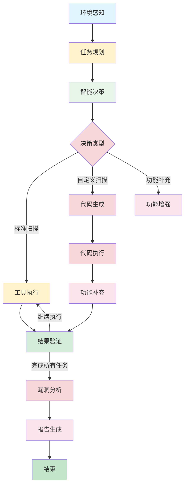

# AI Agents 代码执行模块 - 整合指南

## 概述

本指南详细说明了如何将AI Agent系统与代码执行沙箱深度集成，实现环境感知、代码自动生成和功能补充能力。

## 系统架构

### 整合后的架构

```
┌─────────────────────────────────────────────────────────────┐
│                    API 层 (FastAPI)                    │
│  ┌──────────────────────────────────────────────────┐   │
│  │  Agent API Routes (api/routes.py)      │   │
│  │  - Agent扫描接口                         │   │
│  │  - 代码生成接口                         │   │
│  │  - 代码执行接口                         │   │
│  │  - 功能补充接口                         │   │
│  │  - 环境信息接口                         │   │
│  └──────────────────────────────────────────────────┘   │
└─────────────────────────────────────────────────────────────┘
                          │
                          ▼
┌─────────────────────────────────────────────────────────────┐
│                  决策层 (LangGraph)                    │
│  ┌──────────────────────────────────────────────────┐   │
│  │  ScanAgentGraph (core/graph.py)           │   │
│  │  - 环境感知节点                           │   │
│  │  - 任务规划节点                           │   │
│  │  - 智能决策节点                           │   │
│  │  - 工具执行节点                           │   │
│  │  - 代码生成节点                           │   │
│  │  - 代码执行节点                           │   │
│  │  - 功能补充节点                           │   │
│  │  - 结果验证节点                           │   │
│  │  - 漏洞分析节点                           │   │
│  │  - 报告生成节点                           │   │
│  └──────────────────────────────────────────────────┘   │
└─────────────────────────────────────────────────────────────┘
                          │
        ┌───────────────┴───────────────┐
        ▼                               ▼
┌──────────────────┐          ┌──────────────────┐
│   代码执行层    │          │   工具层        │
│ (code_execution/)│          │ (tools/)        │
│  - 环境感知     │          │  - 注册表         │
│  - 代码生成     │          │  - 封装器         │
│  - 功能补充     │          │  - 适配器         │
│  - 统一执行器   │          └──────────────────┘
└──────────────────┘
```

### 工作流程



## 核心功能

### 1. 环境感知（EnvironmentAwareness）

**功能**：
- 操作系统检测（Windows/Linux/MacOS）
- Python版本和依赖检查
- 可用工具检测（nmap、sqlmap、burpsuite等）
- 网络状态检测（代理、防火墙）
- 磁盘空间和内存状态

**使用场景**：
- 智能决策：根据环境选择最佳扫描策略
- 工具选择：根据可用工具调整扫描方法
- 资源管理：根据系统资源调整并发数

### 2. 代码自动生成（CodeGenerator）

**功能**：
- 基于模板生成扫描脚本
- LLM增强代码生成
- 支持多种扫描类型（端口扫描、漏洞扫描、目录扫描等）
- 支持多种编程语言（Python、Bash、PowerShell）
- 代码安全性验证

**使用场景**：
- 自定义扫描：根据特殊需求生成扫描脚本
- 快速原型：快速生成扫描脚本进行测试
- 功能扩展：生成新功能的实现代码

### 3. 功能补充（CapabilityEnhancer）

**功能**：
- 根据需求动态生成功能补充代码
- 支持新工具集成
- 支持自定义扫描逻辑
- 支持漏洞利用代码生成
- 能力注册和版本管理

**使用场景**：
- 能力扩展：动态添加新的扫描能力
- 自定义逻辑：实现特殊的扫描需求
- 漏洞利用：生成漏洞利用代码

### 4. 统一执行器（UnifiedExecutor）

**功能**：
- 整合环境感知、代码生成和功能补充能力
- 提供安全的代码执行环境
- 支持超时控制和资源限制
- 支持多种编程语言（Python、Bash、PowerShell）
- 执行日志记录

**使用场景**：
- 安全执行：在隔离环境中执行代码
- 资源控制：限制代码执行的资源使用
- 错误处理：统一处理执行错误

## API接口

### 1. Agent扫描接口

**端点**：`POST /api/ai_agents/scan`

**新增参数**：
```json
{
  "target": "http://example.com",
  "enable_llm_planning": true,
  "need_custom_scan": false,
  "custom_scan_type": "vuln_scan",
  "custom_scan_requirements": "",
  "custom_scan_language": "python",
  "need_capability_enhancement": false,
  "capability_requirement": ""
}
```

### 2. 代码生成接口

**端点**：`POST /api/ai_agents/code/generate`

**请求参数**：
```json
{
  "scan_type": "port_scan",
  "target": "http://example.com",
  "requirements": "",
  "language": "python",
  "additional_params": {}
}
```

### 3. 代码执行接口

**端点**：`POST /api/ai_agents/code/execute`

**请求参数**：
```json
{
  "code": "print('Hello, World!')",
  "language": "python",
  "target": "http://example.com"
}
```

### 4. 功能补充接口

**端点**：`POST /api/ai_agents/capabilities/enhance`

**请求参数**：
```json
{
  "requirement": "需要一个新的SQL注入扫描工具",
  "target": "http://example.com",
  "capability_name": "custom_sql_injection_scan"
}
```

### 5. 环境信息接口

**端点**：`GET /api/ai_agents/environment/info`

**响应示例**：
```json
{
  "status": "success",
  "data": {
    "os_info": {...},
    "python_info": {...},
    "available_tools": {...},
    "network_info": {...},
    "system_resources": {...}
  }
}
```

### 6. 能力管理接口

**列出所有能力**：`GET /api/ai_agents/capabilities/list`

**获取能力详情**：`GET /api/ai_agents/capabilities/{capability_name}`

**移除能力**：`DELETE /api/ai_agents/capabilities/{capability_name}`

## 使用示例

### 示例1：标准Agent扫描

```bash
# 启动标准Agent扫描
curl -X POST "http://127.0.0.1:3000/api/ai_agents/scan" \
  -H "Content-Type: application/json" \
  -d '{
    "target": "http://example.com",
    "enable_llm_planning": true
  }'
```

### 示例2：自定义扫描

```bash
# 启动自定义扫描
curl -X POST "http://127.0.0.1:3000/api/ai_agents/scan" \
  -H "Content-Type: application/json" \
  -d '{
    "target": "http://example.com",
    "need_custom_scan": true,
    "custom_scan_type": "port_scan",
    "custom_scan_requirements": "扫描常用端口：21,22,80,443,445,3306,3389,8080"
  }'
```

### 示例3：功能补充

```bash
# 增强功能
curl -X POST "http://127.0.0.1:3000/api/ai_agents/capabilities/enhance" \
  -H "Content-Type: application/json" \
  -d '{
    "requirement": "需要一个新的SQL注入扫描工具",
    "target": "http://example.com"
  }'
```

### 示例4：获取环境信息

```bash
# 获取环境信息
curl "http://127.0.0.1:3000/api/ai_agents/environment/info"
```

### 示例5：Python客户端

```python
import asyncio
import httpx

async def main():
    async with httpx.AsyncClient() as client:
        # 获取环境信息
        env_response = await client.get(
            "http://127.0.0.1:3000/api/ai_agents/environment/info"
        )
        env_info = env_response.json()["data"]
        print(f"操作系统: {env_info['os_info']['system']}")
        print(f"Python版本: {env_info['python_info']['version']}")
        
        # 启动Agent扫描
        scan_response = await client.post(
            "http://127.0.0.1:3000/api/ai_agents/scan",
            json={
                "target": "http://example.com",
                "enable_llm_planning": True
            }
        )
        task_id = scan_response.json()["task_id"]
        print(f"任务已启动: {task_id}")
        
        # 轮询任务状态
        while True:
            task_response = await client.get(
                f"http://127.0.0.1:3000/api/ai_agents/tasks/{task_id}"
            )
            task_info = task_response.json()
            status = task_info["status"]
            
            if status == "completed":
                print("任务完成!")
                print(task_info.get("final_output"))
                break
            elif status == "failed":
                print(f"任务失败: {task_info.get('error_message')}")
                break
            
            print(f"任务状态: {status}")
            await asyncio.sleep(5)

asyncio.run(main())
```

## 扩展开发

### 添加新的代码模板

在`code_generator.py`的`_get_template`方法中添加新模板：

```python
templates = {
    "my_custom_scan": """
#!/usr/bin/env python3
# 自定义扫描模板
def main():
    target = "{target}"
    # 扫描逻辑
    pass

if __name__ == "__main__":
    main()
"""
}
```

### 注册新的能力

使用`CapabilityEnhancer`注册新能力：

```python
from ai_agents.code_execution import CapabilityEnhancer

enhancer = CapabilityEnhancer()

async def my_custom_capability(target: str):
    return {"result": "success"}

enhancer.register_capability(
    name="my_custom_capability",
    description="我的自定义能力",
    execute_func=my_custom_capability,
    version="1.0.0"
)
```

### 添加新的Agent节点

在`core/new_nodes.py`中添加新节点：

```python
class MyCustomNode:
    """
    自定义节点
    """
    
    async def __call__(self, state: AgentState) -> AgentState:
        # 实现节点逻辑
        return state
```

然后在`core/graph.py`中添加节点到工作流：

```python
from .new_nodes import MyCustomNode

def _build_graph(self) -> StateGraph:
    workflow = StateGraph(AgentState)
    workflow.add_node("my_custom_node", MyCustomNode())
    # 添加边连接...
    return workflow
```

## 安全性

### 代码验证

所有代码在执行前都会进行安全性验证，检测以下危险操作：

- `eval(` - 代码注入
- `exec(` - 代码执行
- `system(` - 系统命令执行
- `__import__(` - 动态导入
- `subprocess.call(` - 子进程调用
- `os.system(` - 系统命令执行
- `shell=True` - Shell执行
- `rm -rf` - 危险文件操作
- `format ` - 磁盘格式化
- `pickle.loads` - 反序列化
- `yaml.load` - YAML加载

### 沙箱隔离

代码执行在沙箱环境中进行，提供以下保护：

- 文件系统隔离：限制对系统文件的访问
- 超时控制：防止无限循环
- 资源限制：限制CPU和内存使用
- 执行日志：记录所有执行操作

## 性能优化

### 代码生成优化

- 使用模板缓存：避免重复生成相同模板
- LLM调用优化：减少不必要的LLM调用
- 并发生成：支持多个代码并发生成

### 执行优化

- 超时控制：防止长时间运行的代码
- 资源限制：限制CPU和内存使用
- 结果缓存：缓存执行结果

### 系统优化

- 并发控制：使用`asyncio.Semaphore`限制并发数
- 内存管理：定期清理执行历史和缓存
- 日志优化：使用异步日志记录

## 故障排查

### 常见问题

1. **代码生成失败**
   - 检查LLM配置是否正确
   - 检查网络连接
   - 可以使用模板生成作为备选

2. **代码执行失败**
   - 检查代码语法是否正确
   - 检查是否有危险操作
   - 查看执行日志中的详细错误

3. **功能补充失败**
   - 检查需求描述是否清晰
   - 检查是否有足够的资源
   - 查看增强日志中的详细错误

4. **环境检测失败**
   - 检查是否有足够的权限
   - 检查网络连接
   - 查看环境日志中的详细错误

### 日志查看

所有Agent执行日志记录在`logs/app.log`：

```bash
# 查看实时日志
tail -f logs/app.log

# 搜索特定任务的日志
grep "task_id: 123e4567" logs/app.log

# 搜索特定类型的日志
grep "环境感知" logs/app.log
grep "代码生成" logs/app.log
grep "功能补充" logs/app.log
```

## 总结

AI Agents代码执行模块提供了完整的代码生成和执行能力，具备：

✅ **环境感知**：全面了解执行环境
✅ **代码生成**：支持多种扫描类型的代码自动生成
✅ **功能补充**：动态增强AI Agent能力
✅ **安全执行**：沙箱隔离和代码验证
✅ **统一接口**：提供统一的代码执行接口
✅ **可扩展性**：支持模板扩展和能力注册
✅ **完美集成**：与现有AI Agent系统无缝整合
✅ **架构优化**：移除冗余代码，确保系统结构清晰

通过本系统，AI Agent能够：
- 感知环境信息，做出更智能的决策
- 自动生成扫描代码，快速扩展功能
- 动态补充能力，适应不同扫描需求
- 安全执行代码，确保系统安全
- 统一管理所有扫描工具和能力
