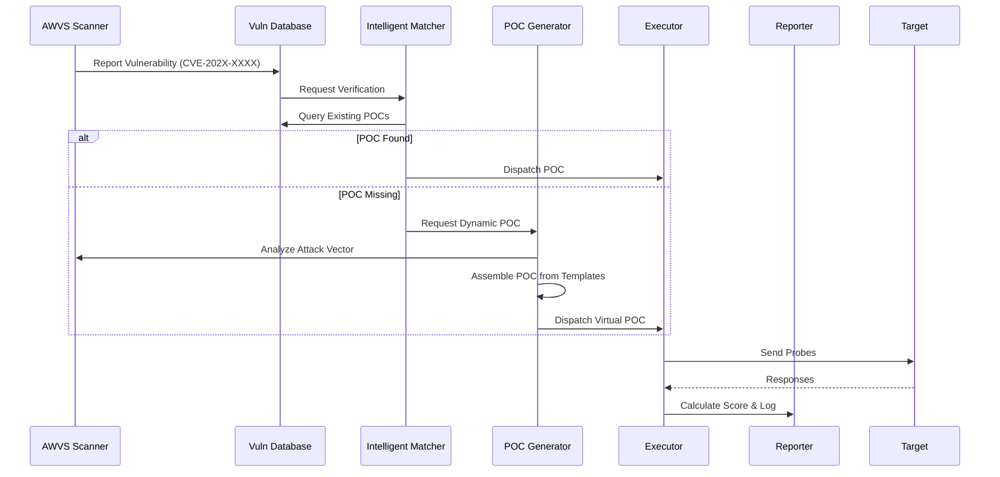

# Dynamic POC Verification Framework Architecture

## 1. Overview
This document outlines the architecture for the new Dynamic POC Verification Framework. The goal is to bridge the gap between vulnerability scan results (e.g., from AWVS) and effective POC verification, especially when direct database mapping is missing.

## 2. Core Components

### 2.1 Intelligent Matching Engine (`POCMatcher`)
The matching engine is responsible for finding the most relevant POCs for a given vulnerability.

*   **Inputs**: Vulnerability Metadata (Title, CVE, Description, Service, Version).
*   **Strategies**:
    1.  **CVE Match**: Direct lookup via CVE ID.
    2.  **Service+Version**: CPPE-like matching (e.g., "WebLogic 10.3.6").
    3.  **Fuzzy Semantic**: Keyword extraction (TF-IDF or simple token overlap) between vuln description and POC tags/description.
    4.  **Fingerprint**: Matching specific paths or error patterns.

### 2.2 Dynamic POC Generator (`AdaptivePOCGenerator`)
When no direct POC is available, this component assembles a verification logic.

*   **Inputs**: AWVS Vulnerability Details (HTTP Request/Response, Attack Vector).
*   **Logic**:
    *   **Template Selection**: Chooses a base template (e.g., `BaseSQLi`, `BaseRCE`, `BaseXSS`) based on vuln type.
    *   **Payload Injection**: Extracts payloads from AWVS output or generates new ones based on the vector.
    *   **Constraint Solving**: Adjusts payloads to fit length/encoding requirements.

### 2.3 Verification Execution Engine (`DistributedExecutor`)
Executes the POCs in a distributed, safe environment.

*   **Features**:
    *   **Polyglot Support**: Python (native), Go/Java (via subprocess/Docker).
    *   **Concurrency**: AsyncIO based worker pool.
    *   **Isolation**: Sandbox execution (optional).

### 2.4 Scoring System (`ConfidenceScorer`)
Evaluates the result of a POC execution.

*   **Metrics**:
    *   **Response Status**: 200 vs 404/500.
    *   **Keyword Match**: Presence of "root:", "syntax error", specific hashes.
    *   **Time-based**: Response delay for blind injections.
    *   **OOB**: Out-of-band interaction (DNS/HTTP).
*   **Output**: 0-100 Score. < 60 = "Manual Confirmation Needed".

## 3. Data Flow



## 4. Directory Structure
```
backend/
  ai_agents/
    poc_system/
      matching/          # New: Intelligent Matching
        matcher.py
        nlp_utils.py
      generation/        # New: Dynamic Generation
        generator.py
        templates/
      scoring/           # New: Scoring Mechanism
        scorer.py
      engine.py          # Refactored Execution Engine
```

## 5. Implementation Plan
1.  **Core Classes**: Implement `POCMatcher`, `AdaptivePOCGenerator`, `ConfidenceScorer`.
2.  **Integration**: Update `verification_engine.py` to use these new components.
3.  **Demos**: Implement the 3 specific scenarios.

## 6. Integration & Usage

### 6.1 Configuration
The integration with the Task Scheduler enables automatic POC verification after an AWVS scan. This is controlled by the Task configuration:

*   **`auto_verify_poc` (bool)**: Default `True`. If set to `True`, the system will automatically trigger a POC verification task upon successful completion of a scan.
*   **Trigger Condition**: Only vulnerabilities with severity `High` or `Critical` will trigger the verification process.
*   **Timeout**: The default timeout for the batch verification task is 1 hour (3600 seconds).

### 6.2 Usage Limitations
*   **Protocol Support**: Currently supports HTTP/HTTPS. Binary protocols are not supported by the dynamic generator.
*   **Authentication**: The dynamic engine inherits authentication headers from the scan configuration if provided, but complex multi-step login flows (e.g., CAPTCHA) may require manual intervention.
*   **Performance**: To prevent denial-of-service, the system processes verification in batches (default 5 concurrent verifications).
*   **False Positives**: While the scoring system reduces false positives, dynamically generated POCs (especially for blind injection) may still require manual review if the score is between 60-80.

### 6.3 Monitoring & Logging
*   **Task Status**: The new POC task will appear as a child task (with `parent_task_id`).
*   **Logs**: Check `backend.task_executor` logs for "Auto-trigger POC verification" messages.
*   **Notifications**: The system broadcasts `task_completed` and `task_progress` events via WebSocket to the frontend.

## 7. CI/CD Pipeline

The project uses GitHub Actions for Continuous Integration. The pipeline is defined in `.github/workflows/ci.yml`.

### 7.1 Workflow Triggers
*   **Push**: Triggers on push to `main` or `master` branches.
*   **Pull Request**: Triggers on PRs targeting `main` or `master`.

### 7.2 Pipeline Steps
1.  **Environment Setup**: Sets up Python environment (testing against 3.9, 3.10, 3.11).
2.  **Dependency Installation**: Installs requirements from `requirements.txt` and testing tools (`pytest`, `pytest-asyncio`).
3.  **Testing**: Runs the integration test suite (`backend/tests/test_integration_new.py`) to verify the core logic of the Dynamic POC Verification Engine and its integration with the Task Executor.
